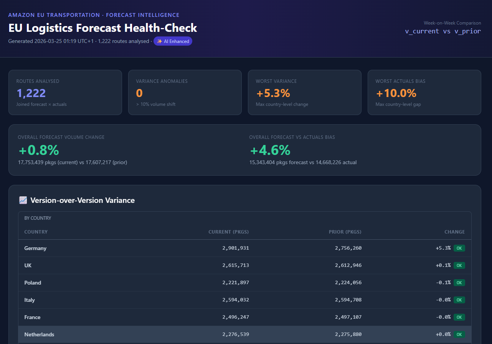

# 🚛 EU Transportation Forecasting - Automated AI Health-Checks System

> **An open-source AI-powered health-check pipeline for weekly transportation demand forecasts.**

---

## 📊 Dashboard Preview



_The generated `logistics_report.html` — a dark-mode executive dashboard with KPI bar, anomaly tables with severity badges (🔴 CRITICAL / 🟠 HIGH), and actionable recommendations. Works fully offline without any API key._

---

## 🌍 Origin Story

This project is a **personal open-source prototype** built in my spare time, directly inspired by a real operational challenge I face at my day job.

I'm a **Forecasting Manager at Amazon EU Transportation**, where my team produces high-quality weekly demand forecasts for transportation and labor capacity planning across the European Union — covering thousands of routes, lanes, and logistics hubs.

Every week, when a new forecast version is published, the team must manually review it to:

- Detect unexpected version-over-version swings before releasing to planning systems
- Validate that the new forecast is grounded in recent demand reality (not drifted too far from actuals)
- Flag anomalies at any granularity — country, lane type, route, network section

This review is currently time-consuming and largely manual. I'm actively working to deploy a production version of this system internally at Amazon — but I first prototyped it here, in my own time, using dummy data, to prove out the multi-agent AI architecture.

**This repo is my public prototype** — fully functional, open-source, and built with the same logic as the internal solution.

---

## 🏗️ Architecture

The pipeline consists of three expert AI agents orchestrated sequentially:

```
weekly_forecast_data.csv  ─┐
                            ├─→ [Pandas Analytics Engine] ─→ variance_data
recent_actuals.csv        ─┘                               ─→ reality_data
                                         │
                              ┌──────────▼───────────┐
                              │   VarianceAnalyst    │  ← AI Agent 1
                              │ v_current vs v_prior │    (optional)
                              └──────────┬───────────┘
                                         │ variance_report
                              ┌──────────▼───────────┐
                              │    RealityChecker    │  ← AI Agent 2
                              │  forecast vs actual  │    (optional)
                              └──────────┬───────────┘
                                         │ reality_report
                              ┌──────────▼───────────┐
                              │  LogisticsReporter   │  ← HTML Builder
                              │  HTML Dashboard      │    (always runs)
                              └──────────┬───────────┘
                                         │
                               logistics_report.html
```

### Key Design Principle: Data-First, AI-Enhanced

Unlike typical AI demo pipelines, this system **always produces a complete report** — even without a single API call:

| Mode                                           | How it works                                                  | Output quality                           |
| ---------------------------------------------- | ------------------------------------------------------------- | ---------------------------------------- |
| **Data-only** (no API key / quota exhausted)   | Pandas pre-computes all analytics; HTML built from DataFrames | ✅ Full professional dashboard           |
| **AI-enhanced** (API key with quota available) | Same + 2 Gemini API calls add narrative paragraphs            | ✅ Full dashboard + executive commentary |

---

## 🤖 What Each Agent Does

### 1. VarianceAnalyst

Receives pre-computed version-over-version statistics (by country, lane type, top routes). Writes an executive narrative flagging anomalies above 10% as **HIGH** or above 25% as **CRITICAL**, with business interpretations.

### 2. RealityChecker

Receives pre-computed forecast vs actuals bias statistics. Identifies systemic over/under-forecast patterns, flags route-level outliers, and provides a risk assessment.

### 3. HTML Report Builder

Always runs locally — no API required. Converts all pandas DataFrames and optional AI narratives into a self-contained dark-mode dashboard:

- **KPI bar**: Routes analysed, anomaly count, worst variance %, worst bias %
- **Variance section**: Country / lane / route tables with severity badges
- **Reality Check section**: Country / lane / route bias tables
- **Recommendations**: 5 actionable items derived from the data

---

## 📁 Project Structure

```
transport_forecast_healthchecks/
│
├── master.py                  # Main pipeline — run this
├── dummy_fcst_generator.py    # Generates enterprise-scale test data
│
├── weekly_forecast_data.csv   # Auto-generated (gitignored)
├── recent_actuals.csv         # Auto-generated (gitignored)
├── logistics_report.html      # Output dashboard (gitignored)
│
├── .env                       # Your API key (gitignored)
├── .env.example               # Template for contributors
├── .gitignore
└── README.md
```

---

## 🚀 Quick Start

### 1. Install dependencies

```bash
pip install pandas sqlalchemy google-genai python-dotenv
```

### 2. (Optional) Set up your Gemini API key

Create a `.env` file:

```
GOOGLE_API_KEY=your_key_here
```

Get a free key at [aistudio.google.com/app/apikey](https://aistudio.google.com/app/apikey).

> **Note:** The API key is optional. The full dashboard is always generated from pandas analytics regardless of API availability. The key only enables AI narrative paragraphs.

### 3. Run

```bash
python master.py
```

The script will:

1. Auto-generate 19,000+ rows of dummy logistics data (if not already present)
2. Pre-compute all variance and bias analytics with pandas
3. Optionally call Gemini to add AI narrative (skips gracefully if quota is exhausted)
4. Save `logistics_report.html` — open it in any browser

---

## 📊 Data Schema

### `weekly_forecast_data.csv`

| Column      | Description                                        |
| ----------- | -------------------------------------------------- |
| `version`   | `v_current` or `v_prior`                           |
| `route`     | Origin–Destination city pair (e.g. `Berlin→Paris`) |
| `date`      | Forecasted delivery date                           |
| `qty`       | Forecasted package volume                          |
| `volume`    | Forecasted cubic volume (m³)                       |
| `country`   | Origin country                                     |
| `lane_type` | `Road`, `Rail`, `Air`, or `Sea`                    |

### `recent_actuals.csv`

| Column          | Description                       |
| --------------- | --------------------------------- |
| `route`         | Same route identifier as forecast |
| `date`          | Actual date                       |
| `actual_qty`    | Actual package volume delivered   |
| `actual_volume` | Actual cubic volume               |

---

## 🔍 Health-Check Logic

### Variance Check (v_current vs v_prior)

```
change_pct = (v_current_qty - v_prior_qty) / v_prior_qty × 100

CRITICAL  → |change_pct| > 25%
HIGH      → |change_pct| > 10%
```

Evaluated at: overall, country, lane type, top-10 routes.

### Reality Check (forecast vs actuals)

```
bias_pct = (forecast_qty - actual_qty) / actual_qty × 100

CRITICAL  → |bias_pct| > 25%
HIGH      → |bias_pct| > 10%
```

Evaluated at: overall, country, lane type, top-10 routes by absolute bias.

---

## 📜 Scripts Reference

### `dummy_fcst_generator.py`

**Purpose**: Synthetic data factory. Generates realistic EU logistics forecast and actuals CSVs that mimic real Amazon transportation data exports — without exposing any real operational data.

**How it works**:

1. Defines a network of **7 countries × 5-6 major cities** as route endpoints
2. Randomly generates **~1,500 unique origin-destination routes** with realistic modal splits (Road 60%, Rail/Air/Sea 40%)
3. For each route × 7 dates, creates two forecast versions (`v_prior`, `v_current`) plus actuals
4. Deliberately **injects two anomalies** to give the health-check system real signals to detect:

| Anomaly                   | Affected dimension                | Signal type                       | Magnitude    |
| ------------------------- | --------------------------------- | --------------------------------- | ------------ |
| Germany Rail demand spike | `country=Germany, lane_type=Rail` | Variance (v_current vs v_prior)   | +40–50%      |
| Air lane over-forecast    | `lane_type=Air`                   | Reality gap (forecast vs actuals) | +20–30% bias |

**Key function**:

```python
generate_massive_logistics_data()
# → weekly_forecast_data.csv   (~19,000 rows)
# → recent_actuals.csv         (~9,000 rows)
```

---

### `master.py`

**Purpose**: Main pipeline orchestrator. Reads the CSVs, runs health-checks, optionally enriches with Gemini AI agents, and renders the HTML dashboard.

**Execution stages**:

| Stage                   | Function                                           | API calls |
| ----------------------- | -------------------------------------------------- | --------- |
| Load data               | `pd.read_csv()`                                    | 0         |
| Variance analytics      | `dim_variance(col)`                                | 0         |
| Reality-check analytics | `dim_bias(col)`                                    | 0         |
| AI narrative (optional) | `call_agent(name, ...)`                            | 0–2       |
| HTML dashboard          | `variance_table_html()`, `bias_table_html()`, etc. | 0         |

**Key functions**:

```python
pct(curr, prior)
# Element-wise % change: (curr - prior) / prior × 100
# Used for both variance and bias calculations.

dim_variance(col)
# Aggregates v_current vs v_prior qty by any column (country / lane_type / route).
# Returns DataFrame sorted by absolute % change — worst anomalies first.

dim_bias(col)
# Aggregates v_current forecast vs actuals qty by any column.
# bias_pct > 0 → over-forecast | bias_pct < 0 → under-forecast

call_agent(name, system_prompt, user_message)
# Makes ONE Gemini API call per agent. Returns empty string immediately
# on quota errors — ensuring the report is always generated.

severity_badge(val)    # Returns HTML badge: CRITICAL / HIGH / OK
variance_table_html()  # Renders variance DataFrame as dark HTML table
bias_table_html()      # Renders bias DataFrame as dark HTML table
kpi_card(...)          # Renders a single KPI metric card
section(...)           # Wraps a report section card with optional AI narrative
```

**Anomaly thresholds** (applied identically to both checks):

```
CRITICAL  |Δ| > 25%   →  Immediate escalation required (red badge)
HIGH      |Δ| > 10%   →  Forecast team review required (orange badge)
OK        |Δ| ≤ 10%   →  Within acceptable bounds (green badge)
```

---

## 🗺️ Roadmap

- [ ] Connect to real forecast database (BigQuery / Redshift)
- [ ] Add time-series accuracy tracking across multiple weeks
- [ ] Email/Slack delivery of the HTML report on forecast publish
- [ ] Deploy to Cloud Run for automated weekly execution
- [ ] Vertex AI Agent Engine deployment for enterprise scale

---

## 📄 License

MIT — feel free to adapt, fork, and build on this.

---

_Built with ❤️ as a side project by an Amazon EU Transportation Forecasting Manager._
